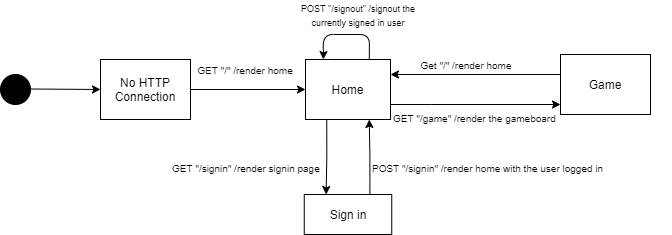
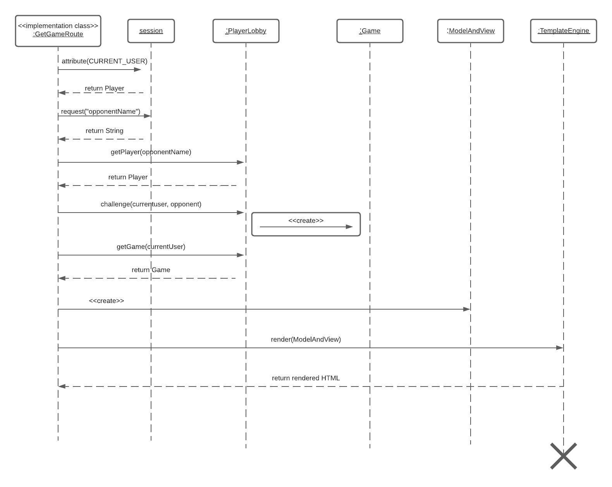
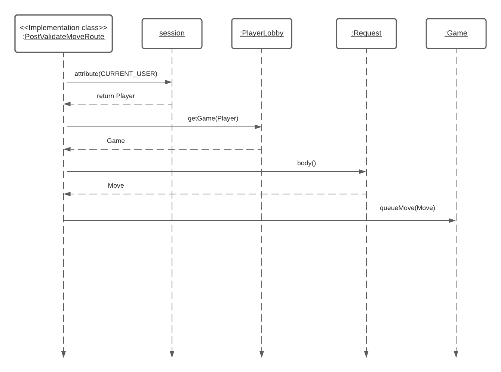
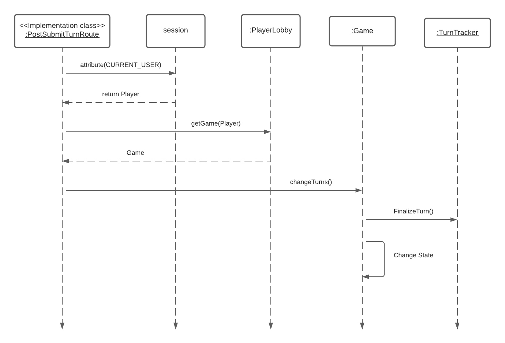
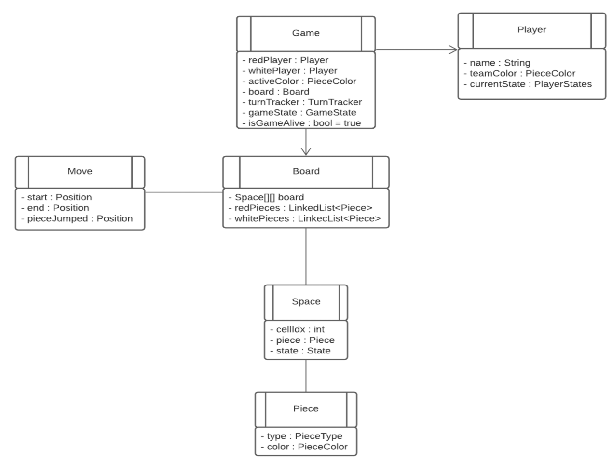
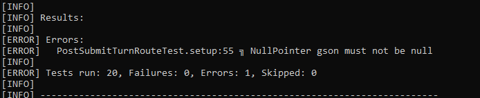

# PROJECT Design Documentation 

> _The following template provides the headings for your Design
> Documentation.  As you edit each section make sure you remove these
> commentary 'blockquotes'; the lines that start with a > character
> and appear in the generated PDF in italics._

## Team Information
* Team name: Good At Checkers
* Team members
  * Justin Kennedy
  * Allison Wright
  * Sam Benoist
  * Hannah Hlotyak
  * Joshua Ross

## Executive Summary

This application, Web Checkers, will allow players to play games of checkers against players who are also currently signed-in. The game user interface will support a game experience using drag-and-drop browser capabilities for making moves.
Beyond the minimum viable product, we plan to include enhancements to the game. These enhancments will expand upon the simple game of checkers, allowing players to challenge the AI or spectate other players playing checkers games.

### Purpose
This is a web-based game of checkers. Checkers players and enthusiests can log in and play/watch their favorite game, checkers! Players will be able to choose to play other  users or the AI. Games consist of 2D web graphics with drag-and-drop capabilities to make our version of web based checkers fun and engaging.

### Glossary and Acronyms
> _Provide a table of terms and acronyms._

| Term | Definition |
|------|------------|
| VO | Value Object |
| UI | User Interface |

## Requirements

This section describes the features of the application.

### Definition of MVP
The Minimum Viable Product will include the following features:
 1. Players will be able to sign-in and sign-out of Web Checkers
 2. Two players will be able to play checkers based on the American rules
 3. During a game, a player will be able to choose to resign at any point, which ends the game

### MVP Features
* Player sign-in
  * _As a player I want to sign-in so that I can play a game of checkers_
  * If players are not already signed in they can see a link on the home page to 'Sign-in'
  * When players are signing-in they can input their name if it follows the restrictions
  * Naming restrictions:
   
* Start a game
  * _As a player I want to start a game so that I can play checkers with an opponent_
  * This feature allows players who are logged in to start a chckers game with another user
  * The board will be set up with the user's pieces on the bottom and the opponents pieces on the bottom
* Player turn
  * _As a player I want to be able to take my turn so that I can continue the game of checkers_
  * This feature allows a player to take their turn according to the rules of American checkers
  * To take a turn, the player must drag and drop their piece onto a valid space
* Player resign
  * _As a player I want to be able to resign at any time so that I can end the game_
  * During a game either player can choose to end the game early by 'resigning'
 
### Roadmap of Enhancements
* Spectator Mode
  * Other players will be able to join games as 'Specators' and watch games without interference
* AI Player
  * Players will be able to choose to play against the server instead of other players

## Application Domain

This section describes the application domain.

Two players (who are users logged in) can play a Checkers Game adhering to the rules of American Checkers. A Checkers game is played on a singular Game Board which has 64 Squares. Each player has 12 pieces, one of which they can move per turn. The pieces can only be on the black squares (so half of the board). A game ends when a player wins (as per the rules of American checkers) or a player resigns. Enhancements will include options to spectate games and players can also choose to play the AI instead of another player.

## Architecture and Design

This section describes the application architecture.

### Summary

The following Tiers/Layers model shows a high-level view of the webapp's architecture.

As a web application, the user interacts with the system using a
browser.  The client-side of the UI is composed of HTML pages with
some minimal CSS for styling the page.  There is also some JavaScript
that has been provided to the team by the architect.

The server-side tiers include the UI Tier that is composed of UI Controllers and Views.
Controllers are built using the Spark framework and View are built using the FreeMarker framework.  The Application and Model tiers are built using plain-old Java objects (POJOs).

Details of the components within these tiers are supplied below.

### Overview of User Interface

This section describes the web interface flow; this is how the user views and interacts
with the WebCheckers application.

When a user firsts goes to the Web Checkers page they will be greeted at the home-page. If they haven't logged in they can click 'Sign-in' and be directed to the Sign-in page to enter their credentials, once they are logged in they will be brought back to the home page. If they are already signed in they can choose to sign-out or they can choose to play a game with another user. If they choose to play a game then they will be directed to the Game page where they can play a game of checkers. Once that game is over the player will be directed back to the home page.

Figure 1. The GetGameRoute to start a game

Figure 2. The ValidateMoveRoute to make sure a move is valid

Figure 3. The SubmitTurnRoute to allow a player to finish their turn

### UI Tier
The UI Tier is what the user interacts with the most, composed of HTML with minimal CSS and JavaScript. The user can play checkers right in their browser by directing themselves to the webcheckers home page and signing in. Once a player signs in with their username they are brought back to the homescreen where they can see other users who are logged in. When the user wants to play a game of checkers they can click on another user and "challenge" them. 

As seen in figure 1, if there are other players online they will show up in the player lobby and the user is able to challenge the opponent which creates a game.

Once in a game players can take turns and make moves, capturing each others pieces until one player wins or resigns.

As seen in figure 2 and figure 3, once a player submits a move the move is then validated (or invalidated) and the players turn is finalized and concluded so the opponent can go through the same proccess.

The game concludes when a player runs out of turns, has all their pieces captured, or resigns. Once a game concludeds the players are brought back to the home page where they can challenge other users or sign-out and finish their webcheckers experience.

### Application Tier
When a player signs in successfully they are added to the PlayerLobby. The PlayerLobby class is responsible for the conditions for players signing in (usernames that follow the convention, usernames that are not taken, etc.), adding and removing (when players sign out) players to the lobby. The Player lobby also has a tally of online players which is needed for players to challenge opponents. The Player Lobby also handles challenges and adding games. 

Once a player is brought into a game they see a game board with checkers pieces on both sides. The BoardController is responsible for initializing the board itself, moving pieces on the board, and removing pieces once they have been captured.

### Model Tier

The Model Tier contains the board and all classes related to the board such as pieces, spaces, positions, and moves. When games are created a board, pieces, spaces, etc. are all also created. The Model Tier also contains the states that game and pieces can have, such as who wins, what type of piece a piece is, colors of pieces, etc. 

### Design Improvements
> _Discuss design improvements that you would make if the project were
> to continue. These improvement should be based on your direct
> analysis of where there are problems in the code base which could be
> addressed with design changes, and describe those suggested design
> improvements. After completion of the Code metrics exercise, you
> will also discuss the resutling metric measurements.  Indicate the
> hot spots the metrics identified in your code base, and your
> suggested design improvements to address those hot spots._

## Testing
> _This section will provide information about the testing performed
> and the results of the testing._

### Acceptance Testing

Our Acceptance testing strategy is for a team member to write the acceptance criteria of a story and then have another team member run through the criteria and report if it passed or failed, and elaborate why it failed. As of 10/25/2021 a total of 8 user stories have passed acceptance testing.

### Unit Testing and Code Coverage

Our unit testing strategy is to have a team member write a unit test for a feature they did not work on. All tests that were run in the code coverage passed except 1 that threw an error we do not have time to solve. This error isn't in relation with the code itself but an issue with Gson we need to work around. As a team we chose the most important unit tests to cover, and because of this we weren't able to get full coverage but covering the code we deemed critical.

### Concerns
* Hitting refresh before sumbitting gives the player an unlimited amount of pieces
* Need to refresh after winning a game to be told you have won
